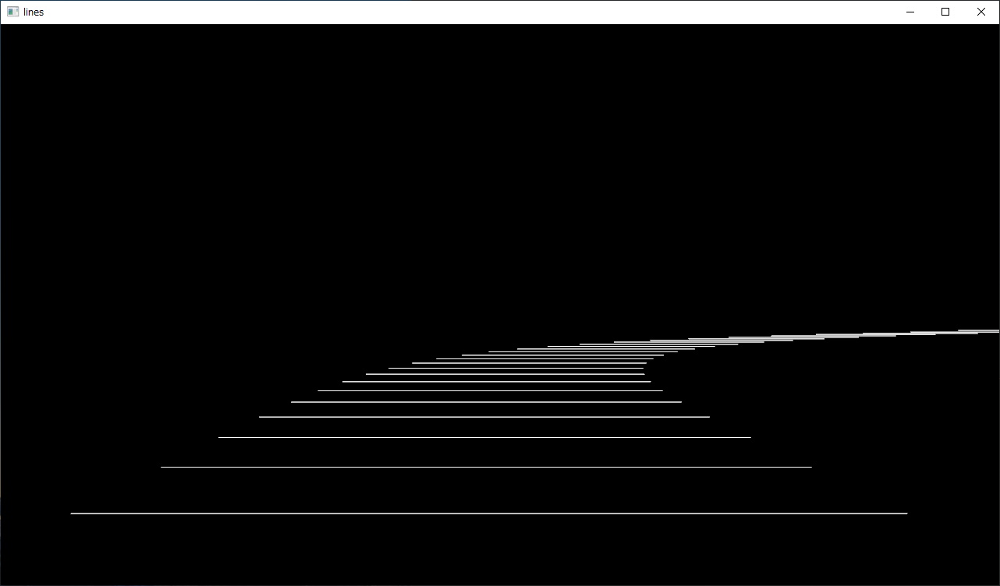
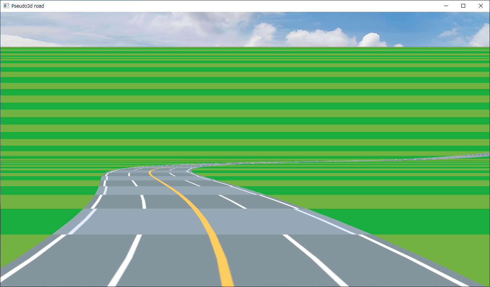
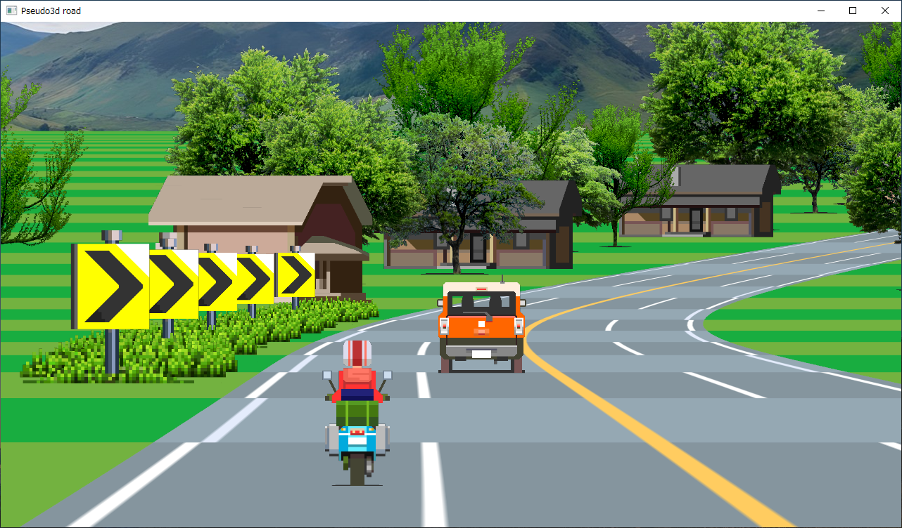

pseudo3d_py
===========

Description
-----------

Pseudo 3D road drawing sample using Python and OpenGL.

* 06_ps3d.py : Draw a pseudo-3D road using only lines
* 09_ps3d_tex.py : Drawing pseudo-3D roads with texture and single color fill
* 10_ps3d_tex.py : Adding billboards and drawing pseudo-3D roads

Screenshots
-----------

Environment
-----------

* Windows10 x64 22H2
* Python 3.10.10 64bit
* PyOpenGL 3.1.6
* glfw 2.7.0
* pillow 10.2.0

License
-------

CC0 / Public Domain

Author
------

[mieki256](https://github.com/mieki256)

